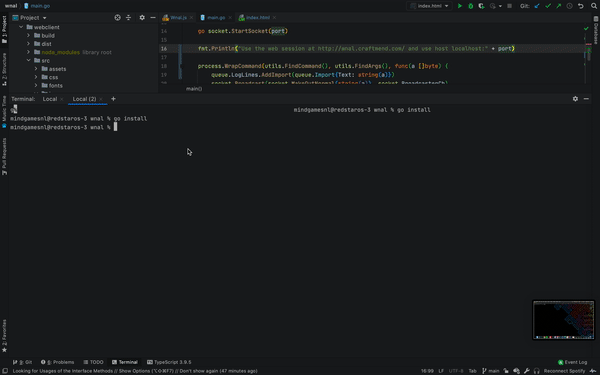

# wnal
Share or control your bash process remotely.
Simply prefix your normal command with `wnal <port>` and you'll get a web console that mirrors/controlls your current session (which could be within a screen)

# Example
Let's say we want a web-shell for our minecraft server
- download wnal for your platform at https://github.com/Mindgamesnl/wnal/releases
- execute `wnal 8080 java -jar spigot.jar -nogui` (where `java -jar spigot.jar -nogui` would start your server normally)
- Navigate to http://wnal.craftmend.com/
- Login as `localhost:8080`
- Profit

Stupidly simple and incredibly useful
